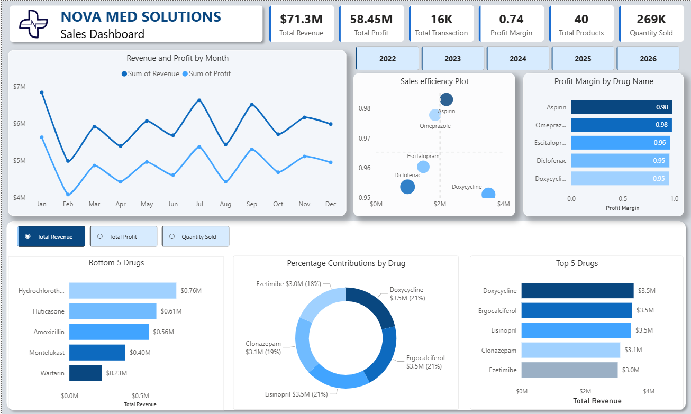

<h1 align="center">Nova Med Solutions Performance Report</h1>

<table align="center">
  <tr>
    <td width="1440">
      <h2 align="center">Client Background</h2>
      <strong>Nova Med Solutions</strong> is a pharmaceutical distributor serving hospitals, smaller distributors, resellers, and direct users across Europe and other global markets. The business depends on reliable medicine supply, strong customer relationships, disciplined pricing, and clear visibility into product demand.
        
      The company has collected sales and customer data covering revenue, profit, medication performance, quantity sold, customer segment, buyer type, demographics, and geography over <strong>2022 to 2026</strong>, generating <strong>$71.3M</strong> in total revenue, <strong>$58.45M</strong> in total profit, <strong>16K</strong> transactions, and <strong>269K</strong> units sold. This analysis turns the operational data into a stakeholder-ready view of where the company is growing, where margin pressure exists, and which customer and market segments deserve more commercial focus.
        
      Reporting for commercial and operations stakeholders, this project focuses on improving revenue visibility, profitability, reseller retention, customer engagement, and market expansion decisions.
      <h3>Northstar Metrics</h3>
      <ul>
        <li><strong>Revenue and profit trends</strong> - Tracking monthly performance, demand peaks, weak periods, and the relationship between revenue and profit.</li>
        <li><strong>Product performance</strong> - Identifying which medications drive revenue, which sell in volume but underperform financially, and where pricing review is needed.</li>
        <li><strong>Sales efficiency</strong> - Comparing product profit margin and cost-to-revenue conversion.</li>
        <li><strong>Customer demographics</strong> - Understanding revenue contribution by gender, age group, segment, and buyer type.</li>
        <li><strong>Geographic performance</strong> - Comparing country-level sales to identify strong markets and underdeveloped opportunities.</li>
      </ul>
    </td>
  </tr>
</table>

<h2 align="center">Business Problems and Objectives</h2>

<table align="center">
  <tr>
    <td width="720" valign="top">
      <h3>Business Problem</h3>
      Nova Med Solutions has a broad customer base and product portfolio, but its sales data is underused. This limits the company's ability to explain monthly revenue movement, separate high-demand products from high-profit products, and identify which customer channels deserve the most protection.
        
      The core risk is that strong headline sales may hide margin leakage, reseller concentration risk, and missed opportunities in lower-performing countries or customer segments.
    </td>
    <td width="720" valign="top">
      <h3>Project Objectives</h3>
      <ul>
        <li>Identify customer segments and buyer types driving the largest revenue share.</li>
        <li>Compare revenue, quantity sold, and profit margin across medications.</li>
        <li>Detect seasonal sales patterns that can improve forecasting.</li>
        <li>Understand demographic and geographic performance differences.</li>
        <li>Build an interactive Power BI dashboard for stakeholder decision-making.</li>
      </ul>
    </td>
  </tr>
</table>

<h1 align="center">Executive Summary</h1>

<h3 align="center">Revenue and Profit Trend</h3>

  

<table align="center">
  <tr>
    <td width="480" valign="top">
      <h3>Revenue and Profit Growth</h3>
      <ul>
        <li>Nova Med Solutions generated <strong>$71.3M</strong> in revenue and <strong>$58.45M</strong> in profit across the reporting period.</li>
        <li>Revenue and profit move closely together, which suggests profit is strongly tied to sales volume and supported by a total profit margin of <strong>0.74</strong>.</li>
        <li>The gap between revenue and profit appears consistent across the year, meaning cost control is relatively stable at the total-business level.</li>
        <li>Nova Med Solutions does not appear to have a company-wide cost-control crisis; the stronger issue is how consistently demand is being generated across the year.</li>
      </ul>
    </td>
    <td width="480" valign="top">
      <h3>Quarterly Insight</h3>
      <ul>
        <li>The year is not evenly paced. January is the strongest month at approximately <strong>$6.8M</strong> revenue, followed by July at about <strong>$6.6M</strong> and September at about <strong>$6.5M</strong>.</li>
        <li>February drops sharply to approximately <strong>$5.0M</strong> revenue and <strong>$4.1M</strong> profit, making it the clearest low-performance month.</li>
        <li>The February dip should be investigated because it may reflect weak post-peak demand, inventory availability, seasonality, or campaign timing.</li>
        <li>Planning should focus on smoothing low months while preparing inventory and commercial activity around proven peak periods.</li>
      </ul>
    </td>
  </tr>
</table>

<table align="center">
  <tr>
    <td width="960">
      <h3>Executive Takeaway</h3>
      The business is profitable when demand is strong, with <strong>$71.3M</strong> in total revenue and <strong>$58.45M</strong> in total profit, but revenue momentum is uneven. The high-performing months with sales peaks around <strong>$6.5M to $6.8M</strong> should be leveraged to improve forecasting, campaign timing, and stock planning, while investigating why February underperforms at roughly <strong>$5.0M</strong>.
    </td>
  </tr>
</table>

<h2 align="center">Dataset Structure and Analysis Process</h2>

<table align="center">
  <tr>
    <td width="960">
      The project analysis was carried out using Power BI as the Business intelligence tool. The dataset consist of several metrics that includes; revenue, profit, medication performance, quantity sold, customer demographics, buyer type, customer segment, and country-level sales performance.
        
      The workflow followed this analytics process: data collection, cleaning, ETL, Power BI modelling, DAX/KPI creation, dashboard design, and insight reporting.
    </td>
  </tr>
</table>

  <h3>Sales Dashboard</h3>
  

<table align="center">
  <tr>
    <td width="960">
      <h3>Sales Dashboard Role</h3>
      The sales dashboard summarizes the core business position: <strong>$71.3M</strong> total revenue, <strong>$58.45M</strong> total profit, <strong>16K</strong> transactions, <strong>0.74</strong> profit margin, <strong>40</strong> products, and <strong>269K</strong> units sold. It provides the first-page view of overall commercial performance before the customer dashboard adds detail on segments, buyer type, and demographics.
    </td>
  </tr>
</table>

  <h3>Customer Dashboard</h3>
  

<table align="center">
  <tr>
    <td width="960">
      <h3>Dashboard Role</h3>
      The dashboard acts as the stakeholder control layer for the analysis. It connects commercial metrics to product, customer, and geography views so decision-makers can move from headline revenue to the underlying drivers of performance.
    </td>
  </tr>
</table>

<h1 align="center">Insights Deep-Dive</h1>

<h1 align="center">Product Performance</h1>

<table align="center">
  <tr align="center">
    <td width="480" valign="top">
      <h3>Top 5 Drugs by Revenue</h3>
      
    </td>
    <td width="480" valign="top">
      <h3>Top 5 Revenue Contribution</h3>
      
    </td>
  </tr>
</table>

<table align="center">
  <tr>
    <td width="480" valign="top">
      <h3>Revenue Concentration</h3>
      <ul>
        <li>Doxycycline, Ergocalciferol, and Lisinopril form the strongest revenue base, each contributing approximately <strong>$3.5M</strong> and <strong>21%</strong> of top-five revenue.</li>
        <li>Clonazepam follows at approximately <strong>$3.1M</strong> and <strong>19%</strong>, while Ezetimibe contributes approximately <strong>$3.0M</strong> and <strong>18%</strong>.</li>
        <li>No single product appears to dominate the entire top group, which reduces overdependence on one medication.</li>
      </ul>
    </td>
    <td width="480" valign="top">
      <h3>Performance Insight</h3>
      <ul>
        <li>The top portfolio is commercially healthy because revenue is distributed across multiple strong products.</li>
        <li>This gives Nova Med Solutions flexibility: the business can defend several high-value products rather than relying on one flagship medication.</li>
      </ul>
    </td>
  </tr>
</table>

<table align="center">
  <tr align="center">
    <td width="960" valign="top">
      <h3>Warfarin Delivers the Lowest Revenue</h3>
      
    </td>
  </tr>
</table>

<table align="center">
  <tr>
    <td width="480" valign="top">
      <h3>Low-Revenue Products</h3>
      <ul>
        <li>Hydrochlorothiazide, Fluticasone, Amoxicillin, Montelukast, and Warfarin sit at the lower end of revenue performance, ranging from <strong>$0.76M</strong> for Hydrochlorothiazide to <strong>$0.23M</strong> for Warfarin.</li>
        <li>Hydrochlorothiazide, Montelukast, and Amoxicillin show stronger unit demand than their revenue ranking suggests, with demand around <strong>7.5K to 7.6K</strong> compared with Doxycycline and Ergocalciferol at about <strong>7.1K</strong>.</li>
        <li><strong>Doxycycline leads revenue but does not lead quantity sold; Lisinopril leads quantity sold at approximately </strong><strong>11.1K</strong>, about <strong>36%</strong> above Doxycycline, which points to a pricing, margin, or product-mix difference.</li>
      </ul>
    </td>
    <td width="480" valign="top">
      <h3>Demand vs Revenue Gap</h3>
      <ul>
        <li>Hydrochlorothiazide, Montelukast, and Amoxicillin have high quantity demand of about <strong>7.5K</strong>, but remain in the lowest revenue portfolio.</li>
        <li>The revenue gap is visible in the bottom-five chart: Hydrochlorothiazide generates about <strong>$0.76M</strong>, Fluticasone <strong>$0.61M</strong>, Amoxicillin <strong>$0.56M</strong>, Montelukast <strong>$0.40M</strong>, and Warfarin <strong>$0.23M</strong>.</li>
        <li>These products should be reviewed for pricing, discounting, package size, procurement cost, or channel mix.</li>
        <li>The commercial team should separate "high-demand products" from "high-revenue products" so pricing decisions are based on margin opportunity, not only sales volume.</li>
      </ul>
    </td>
  </tr>
</table>

  <h3>Top and Bottom Drugs by Quantity Sold</h3>
  

<h1 align="center">Profit Margin and Sales Efficiency</h1>

  

<table align="center">
  <tr>
    <td width="480" valign="top">
      <h3>Margin Leaders</h3>
      <ul>
        <li>Aspirin and Omeprazole show the strongest margin efficiency, with profit margins of <strong>0.98</strong>.</li>
        <li>Escitalopram also performs strongly from a profitability standpoint with a value of <strong>0.96</strong>.</li>
        <li>Diclofenac and Doxycycline both sit around <strong>0.95</strong>, but Doxycycline is more commercially important because it contributes approximately <strong>$3.5M</strong> in revenue.</li>
      </ul>
    </td>
    <td width="480" valign="top">
      <h3>Profit Efficiency Opportunity</h3>
      <ul>
        <li>Nova Med Solutions has two different product stories: products that drive revenue and products that convert sales into profit most efficiently.</li>
        <li>Aspirin should be treated as a margin-protection and growth candidate because each additional sale appears to convert strongly into profit at a margin of <strong>0.98</strong>.</li>
        <li>Doxycycline should remain a priority because it generates about <strong>$3.5M</strong> in revenue, but stakeholders should review supplier costs, discounts, and operating costs to improve its profit conversion from <strong>0.95</strong>.</li>
      </ul>
    </td>
  </tr>
</table>

<table align="center">
  <tr align="center">
    <td width="480" valign="top">
      <h3>Doxycycline Revenue and Profit</h3>
      
    </td>
    <td width="480" valign="top">
      <h3>Aspirin Revenue and Profit</h3>
      
    </td>
  </tr>
</table>

<table align="center">
  <tr>
    <td width="480" valign="top">
      <h3>Doxycycline Margin Pressure</h3>
      <ul>
        <li>Doxycycline has clear sales spikes in early-year, mid-year, and late-year periods.</li>
        <li>Revenue and profit move together, but the visible gap suggests costs are taking a meaningful share of the product's approximately <strong>$3.5M</strong> revenue.</li>
        <li>The product is important for sales growth, but margin improvement above its current <strong>0.95</strong> level would make its growth more valuable.</li>
      </ul>
    </td>
    <td width="480" valign="top">
      <h3>Aspirin Profit Stability</h3>
      <ul>
        <li>Aspirin shows tighter alignment between revenue and profit.</li>
        <li>This indicates stable cost structure, predictable demand, and stronger profit conversion at a margin of <strong>0.98</strong>.</li>
        <li><strong>Stakeholders should consider whether Aspirin can be scaled through reseller incentives or targeted demand generation while protecting the</strong> <strong>0.98</strong> margin profile.</li>
      </ul>
    </td>
  </tr>
</table>

<h1 align="center">Customer Demographics and Segments</h1>

<table align="center">
  <tr align="center">
    <td width="480" valign="top">
      <h3>Revenue by Gender</h3>
      
    </td>
    <td width="480" valign="top">
      <h3>Revenue by Customer Segment</h3>
      
    </td>
  </tr>
</table>

<table align="center">
  <tr>
    <td width="480" valign="top">
      <h3>Demographic Revenue Pattern</h3>
      <ul>
        <li>Male customers contribute the highest revenue, with a notable peak around <strong>$3.3M</strong> in May.</li>
        <li>Female customers and the Other category follow similar patterns but at lower levels.</li>
        <li>Preferred customers contribute <strong>36%</strong> of revenue, new customers <strong>34%</strong>, and frequent buyers <strong>30%</strong>.</li>
      </ul>
    </td>
    <td width="480" valign="top">
      <h3>Customer Segment Opportunity</h3>
      <ul>
        <li>The customer base is not evenly monetized. Male customers are currently the strongest demographic revenue engine, peaking at about <strong>$3.3M</strong>.</li>
        <li>New customers nearly match preferred customers, with <strong>34%</strong> compared with <strong>36%</strong>, which suggests customer acquisition rate is good.</li>
        <li>The lower frequent-buyer share of <strong>30%</strong> is a warning sign: Nova Med Solutions may be winning customers but not fully converting them into higher-value repeat customers.</li>
      </ul>
    </td>
  </tr>
</table>

<table align="center">
  <tr align="center">
    <td width="320" valign="top">
      <h3>Segment by Gender</h3>
      
    </td>
    <td width="320" valign="top">
      <h3>Revenue by Buyer Type</h3>
      
    </td>
    <td width="320" valign="top">
      <h3>Revenue by Age</h3>
      
    </td>
  </tr>
</table>

<table align="center">
  <tr>
    <td width="320" valign="top">
      <h3>Segment View</h3>
      <ul>
        <li>Male customers dominate across multiple customer segments.</li>
        <li>The Other gender category appears weaker among frequent buyers.</li>
        <li>This points to a targeted engagement opportunity.</li>
      </ul>
    </td>
    <td width="320" valign="top">
      <h3>Buyer-Type View</h3>
      <ul>
        <li>Resellers generate <strong>88%</strong> of total revenue.</li>
        <li>Direct users contribute a much smaller share.</li>
        <li>This makes reseller retention one of the highest-priority commercial risk.</li>
      </ul>
    </td>
    <td width="320" valign="top">
      <h3>Age View</h3>
      <ul>
        <li>Revenue is relatively competitive across age groups.</li>
        <li>The business is not overly dependent on one age bracket.</li>
        <li>This supports broad market positioning rather than narrow age-based targeting.</li>
      </ul>
    </td>
  </tr>
</table>

<table align="center">
  <tr>
    <td width="960">
      <h3>Customer Story</h3>
      Nova Med Solutions is highly dependent on reseller channels, which generate <strong>88%</strong> of revenue, and has strong revenue from male customers, including a peak around <strong>$3.3M</strong>. The customer segment mix shows room to improve repeat-purchase value because frequent buyers contribute <strong>30%</strong>, below preferred customers at <strong>36%</strong> and new customers at <strong>34%</strong>. <strong>The company should protect reseller relationships first, then use targeted campaigns to increase frequent-buyer contribution and unlock growth from under-penetrated demographic groups.</strong>
    </td>
  </tr>
</table>

<h1 align="center">Geographical Insights</h1>

<table align="center">
  <tr align="center">
    <td width="480" valign="top">
      <h3>Revenue by Country</h3>
      
    </td>
    <td width="480" valign="top">
      <h3>Country Drilldown by Segment</h3>
      
    </td>
  </tr>
</table>

<table align="center">
  <tr>
    <td width="480" valign="top">
      <h3>Market Concentration</h3>
      <ul>
        <li>Canada is the strongest market, generating approximately <strong>$32M</strong> in revenue.</li>
        <li>Australia contributes approximately <strong>$15M</strong>, making it a strong secondary market.</li>
        <li>The United States generates approximately <strong>$6M</strong>, making it the lowest-performing market in the view.</li>
      </ul>
    </td>
    <td width="480" valign="top">
      <h3>Expansion Opportunity</h3>
      <ul>
        <li>The geographic revenue base is uneven. Canada is the clear anchor market at approximately <strong>$32M</strong>, while the United States appears underdeveloped at approximately <strong>$6M</strong>.</li>
        <li>The country drilldown suggests Preferred Customers are important to high-performing market revenue.</li>
        <li>Stakeholders should investigate whether lower-performing countries have weaker reseller coverage, pricing barriers, lower availability, or less effective customer acquisition.</li>
      </ul>
    </td>
  </tr>
</table>

<h1 align="center">Recommendations</h1>

<table align="center">
  <tr>
    <td width="960">
      <h3>Based on the uncovered insights, these are the main actions Nova Med Solutions can take from the analysis.</h3>
    </td>
  </tr>
</table>

<table align="center">
  <tr>
    <td width="480" valign="top">
      <h3>Sales and Forecasting</h3>
      <ul>
        <li>Investigate the February revenue dip of approximately <strong>$5.0M</strong> and identify whether it is caused by demand seasonality, stock availability, campaign timing, or channel performance.</li>
        <li>Use January at approximately <strong>$6.8M</strong>, July at approximately <strong>$6.6M</strong>, and September at approximately <strong>$6.5M</strong> as planning anchors for inventory, reseller engagement, and promotional campaigns.</li>
        <li>Track monthly revenue and profit variance so commercial teams can respond earlier to demand changes.</li>
      </ul>
    </td>
    <td width="480" valign="top">
      <h3>Product Strategy</h3>
      <ul>
        <li>Review pricing and procurement costs for Hydrochlorothiazide, Montelukast, and Amoxicillin because they show unit demand of roughly <strong>7.5K to 7.6K</strong> but sit in the lower revenue portfolio.</li>
        <li>Protect Lisinopril and Doxycycline as core products; Lisinopril leads quantity sold at about <strong>11.1K</strong>, while Doxycycline contributes approximately <strong>$3.5M</strong> in revenue.</li>
        <li>Scale Aspirin through reseller incentives or targeted demand generation because it appears highly efficient from a margin perspective at <strong>0.98</strong>.</li>
      </ul>
    </td>
  </tr>
  <tr>
    <td width="480" valign="top">
      <h3>Customer and Channel Strategy</h3>
      <ul>
        <li>Prioritize reseller retention because resellers generate <strong>88%</strong> of total revenue.</li>
        <li>Develop retention campaigns that move new customers from their current <strong>34%</strong> revenue share into frequent-buyer behavior.</li>
        <li>Strengthen engagement with high-value male customers, who peak around <strong>$3.3M</strong>, while testing growth opportunities in under-penetrated demographic groups.</li>
      </ul>
    </td>
    <td width="480" valign="top">
      <h3>Geographic Strategy</h3>
      <ul>
        <li>Protect Canada as the highest-value market at approximately <strong>$32M</strong> and document which commercial practices are driving its performance.</li>
        <li>Investigate United States underperformance at approximately <strong>$6M</strong> by reviewing reseller coverage, pricing, availability, and acquisition channels.</li>
        <li>Build localized growth plans for lower-contributing countries instead of applying one global sales approach.</li>
      </ul>
    </td>
  </tr>
</table>

<h2 align="center">Project Links</h2>

<table align="center">
  <tr>
    <td width="960">
      <ul>
        <li>Portfolio case study: <a href="https://emmakola.github.io/project.html">Nova Med Solutions</a></li>
        <li>GitHub profile: <a href="https://github.com/EmmaKola">EmmaKola</a></li>
      </ul>
    </td>
  </tr>
</table>
