# Nova Med Solutions Performance Report

## Client Background

Nova Med Solutions is a pharmaceutical distributor supporting hospitals, smaller distributors, resellers, and direct users across Europe and other global markets. The business provides access to essential medications and relies on dependable supply, strong customer relationships, and informed product planning to maintain commercial performance.

The company has collected sales data covering revenue, profit, product performance, customer demographics, buyer type, and geography. This project analyzes that data to help Nova Med Solutions improve sales visibility, identify high-value customer segments, understand product profitability, and uncover market opportunities.

Reporting to business stakeholders, the analysis focuses on translating sales and customer data into practical recommendations that can improve revenue growth, profitability, customer engagement, and operational decision-making.

### Northstar Metrics

* Revenue and profit trends - Tracking monthly sales performance, profit movement, and seasonal peaks or dips.
* Product performance - Identifying top-performing and underperforming medications by revenue, quantity sold, and margin.
* Sales efficiency - Reviewing profit margin, cost-to-revenue conversion, and product-level efficiency.
* Customer demographics - Understanding revenue contribution by gender, age group, customer segment, and buyer type.
* Geographic performance - Comparing revenue across countries to identify strong markets and growth opportunities.

## Business Problems and Objectives

Nova Med Solutions is underutilizing its sales and customer data, which limits visibility into performance and makes it harder to identify market opportunities across its operating regions.

The project focuses on the following objectives:

* Identify the customer segments that contribute most to revenue.
* Analyze profit margins across medications and regions.
* Detect sales patterns that can support forecasting and planning.
* Understand the demographics of high-value and loyal customers.
* Build an interactive Power BI dashboard for stakeholder reporting.
* Prepare recommendations that can guide commercial and operational improvements.

# Executive Summary

### Revenue and Profit Performance

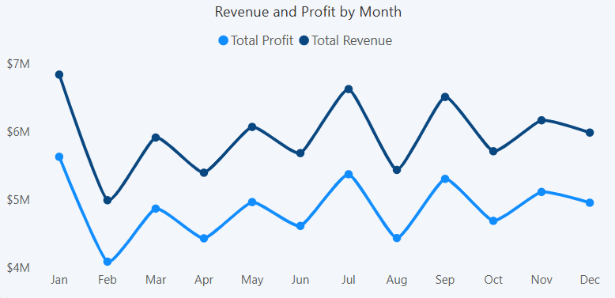

1. Revenue is not growing consistently month over month:
   * Performance shows clear peaks in January, July, and September.
   * February records a sharp decline, suggesting seasonal demand shifts or planning inefficiencies.

2. Profit closely follows revenue:
   * The gap between revenue and profit remains relatively stable across the year.
   * This suggests cost control is reasonably consistent, even though growth momentum is uneven.

3. Key takeaway:
   * Nova Med Solutions should strengthen demand forecasting around low-performing months and investigate the drivers behind seasonal peaks.
   * Revenue planning should focus on improving consistency rather than only maximizing high-demand periods.

## Dataset Structure and Analysis Process

The available project information describes a Power BI-led analysis using sales and customer data. The dataset includes revenue, profit, medication performance, quantity sold, customer demographics, buyer type, customer segment, and country-level sales performance.

The analysis followed these stages:

1. Data collection - Sourcing and validating sales and customer data from internal business records.
2. Data cleaning - Removing duplicates, correcting inconsistencies, and preparing the dataset for analysis.
3. ETL process - Transforming and loading cleaned data into Power BI.
4. Data modelling - Creating table relationships and a reporting model to support dashboard analysis.
5. Calculations - Building DAX measures, KPIs, and calculated fields.
6. Dashboard creation - Developing interactive visuals and drill-down views for stakeholder decision-making.

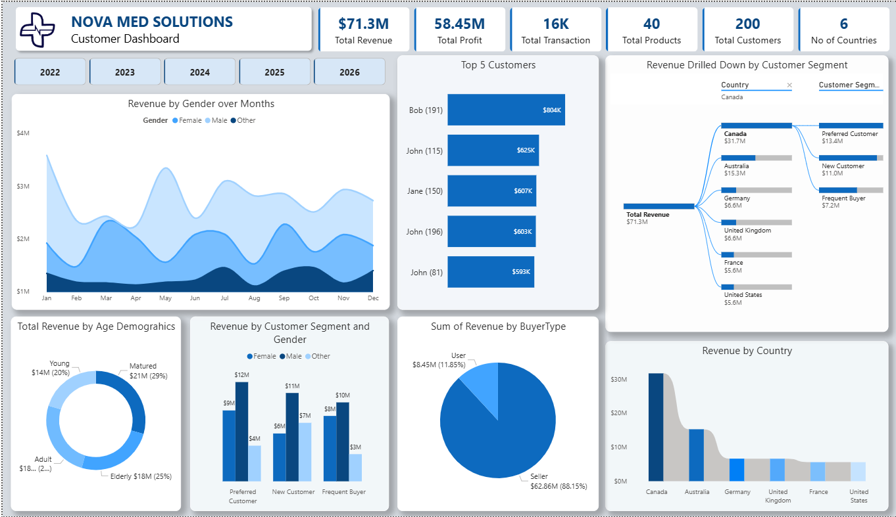

# Insights Deep-Dive

# Product Performance

### Top-Performing Products

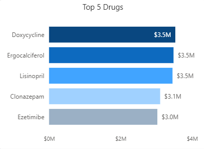

* Doxycycline, Ergocalciferol, and Lisinopril form a stable revenue core for Nova Med Solutions.
* Clonazepam and Ezetimibe follow closely, showing that revenue is spread across several strong medications rather than concentrated in only one product.
* The top five products show a balanced product mix, which reduces dependency risk and indicates consistent demand across the leading portfolio.

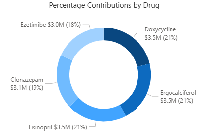

### Underperforming Products

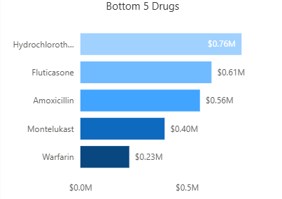

* Hydrochlorothiazide, Fluticasone, Amoxicillin, Montelukast, and Warfarin generate substantially lower revenue than the leading medications.
* Their weaker revenue performance may reflect lower pricing, stronger competition, shifting demand, or reduced commercial positioning.
* Several lower-revenue products still appear to have strong unit demand, which makes pricing and margin review important.

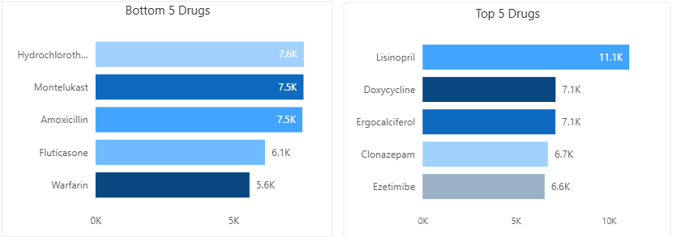

### Revenue vs Quantity Sold

* Doxycycline is the strongest revenue contributor but ranks second in units sold.
* Lisinopril has stronger margin performance, while Doxycycline appears to have a sales margin around 36% lower than Lisinopril.
* Hydrochlorothiazide, Montelukast, and Amoxicillin show higher sales volumes than some top revenue products, suggesting they may be high-demand but lower-priced medications.

# Profit Margin and Sales Efficiency

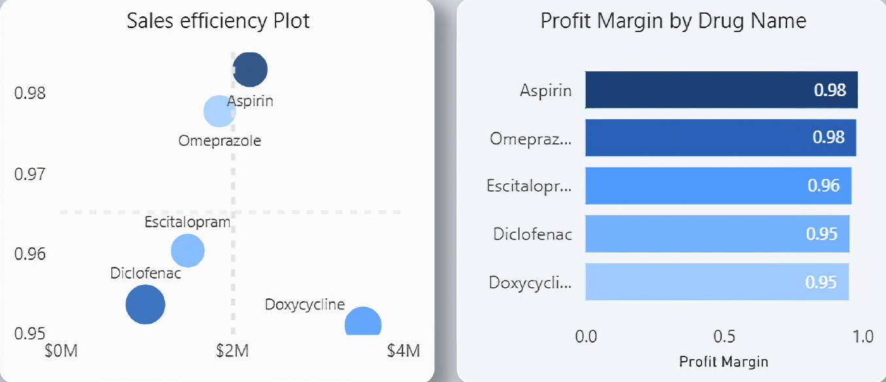

* Aspirin and Omeprazole are the most efficient performers, with profit margins close to 0.98.
* Escitalopram also performs strongly from a profitability standpoint.
* Doxycycline is a top-selling product but has comparatively lower efficiency, which may point to higher cost structures or margin compression.

### Doxycycline Performance

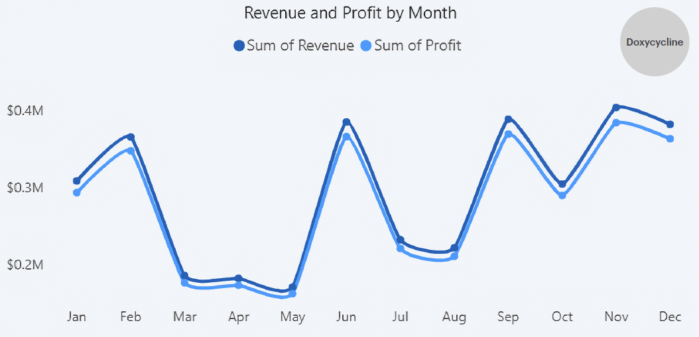

* Doxycycline shows a visible gap between revenue and profit, suggesting product costs may not be fully optimized.
* Revenue and profit still move in similar directions, indicating strong correlation between demand and profitability.
* Sales spikes in early-year, mid-year, and late-year periods highlight important demand windows.

### Aspirin Performance

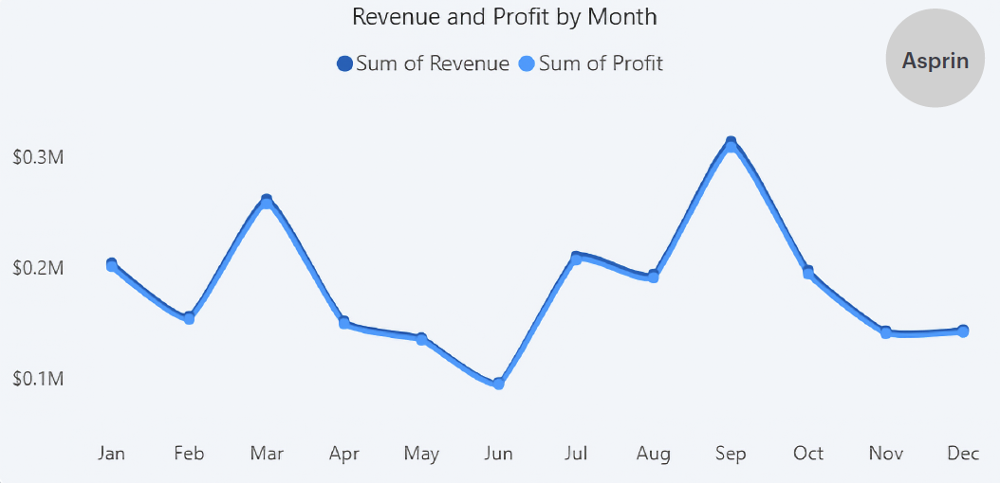

* Aspirin shows a more stable revenue and profit relationship.
* Profit tracks revenue closely, indicating predictable demand and strong cost control.
* Its high margin makes it a strong candidate for targeted growth initiatives.

# Customer Demographics

### Revenue by Gender

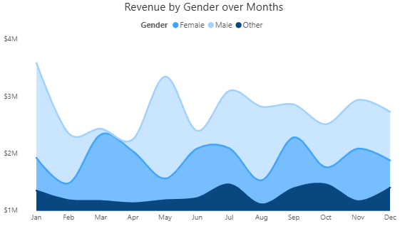

* Male customers contribute the highest revenue across the analyzed period.
* Female customers and the Other gender category follow a similar pattern but at slightly lower levels.
* The Other category appears under-penetrated and may represent an opportunity for targeted engagement.

### Revenue by Customer Segment

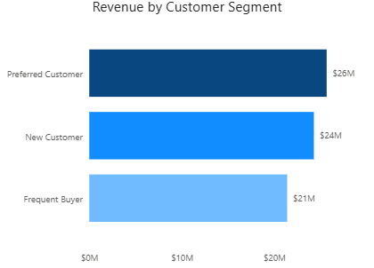

* Preferred customers contribute 36% of total revenue.
* New customers contribute 34%, showing strong first-time buyer conversion.
* Frequent buyers contribute 30%, suggesting there may be room to improve repeat-purchase behavior.

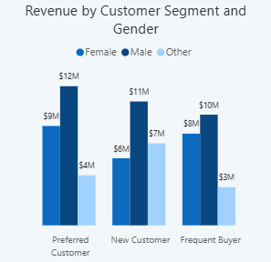

### Revenue by Buyer Type

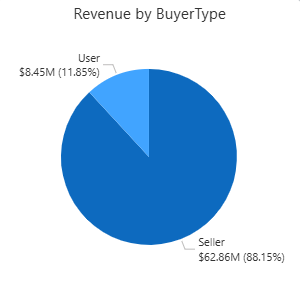

* Resellers contribute 88% of total revenue.
* Direct users account for a much smaller share of revenue.
* Nova Med Solutions is highly dependent on reseller channels, making reseller retention a major commercial priority.

### Revenue by Age Group

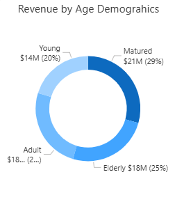

* Revenue contribution is relatively competitive across age groups.
* This indicates broad market penetration rather than dependence on a single age demographic.

# Geographic Results

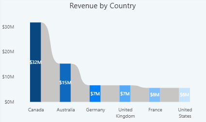

* Canada generates the highest revenue at approximately $32M.
* Australia contributes around $15M, making it a strong secondary market.
* The United States generates the lowest revenue at approximately $6M.
* Other countries contribute lower shares of revenue, which may indicate untapped market opportunities.

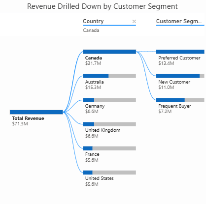

* A drill-down of the highest-performing country shows that Preferred Customers are a key revenue driver.
* Variability across other countries suggests that market-specific strategies may be needed.

# Recommendations

#### Based on the uncovered insights, these are the main actions Nova Med Solutions can take from the analysis.

### Sales and Forecasting

* Improve demand forecasting around months with weaker revenue, especially February.
* Use high-performing months such as January, July, and September as planning anchors for inventory, sales campaigns, and reseller engagement.
* Track monthly revenue and profit variance to detect demand changes earlier.

### Products

* Review pricing for Hydrochlorothiazide, Montelukast, and Amoxicillin because they show stronger unit demand but weaker revenue contribution.
* Put Lisinopril on a structured price and supplier-cost review cycle to protect profitability.
* Investigate Doxycycline cost structure because it drives strong revenue but shows lower margin efficiency than some other products.
* Scale Aspirin demand through targeted campaigns or channel incentives, given its high profit margin.

### Customer Segments

* Strengthen engagement with male customers, currently the highest-revenue demographic segment.
* Explore growth opportunities in the Other gender category, which may be under-penetrated.
* Improve repeat-purchase strategy for frequent buyers so this segment contributes more than its current 30% revenue share.

### Buyer Type

* Prioritize reseller retention because resellers generate 88% of total revenue.
* Offer reseller-focused incentives, competitive pricing, and value-added partnerships to protect market share.
* Continue developing direct-user channels, but without weakening the reseller base that currently drives the business.

### Geography

* Protect and expand the Canadian market, which is the strongest revenue contributor.
* Investigate why the United States underperforms relative to other markets.
* Build localized strategies for lower-contributing countries where the dashboard indicates untapped market opportunity.

## Project Links

* Portfolio case study: [Nova Med Solutions](https://emmakola.github.io/project.html)
* GitHub profile: [EmmaKola](https://github.com/EmmaKola)
